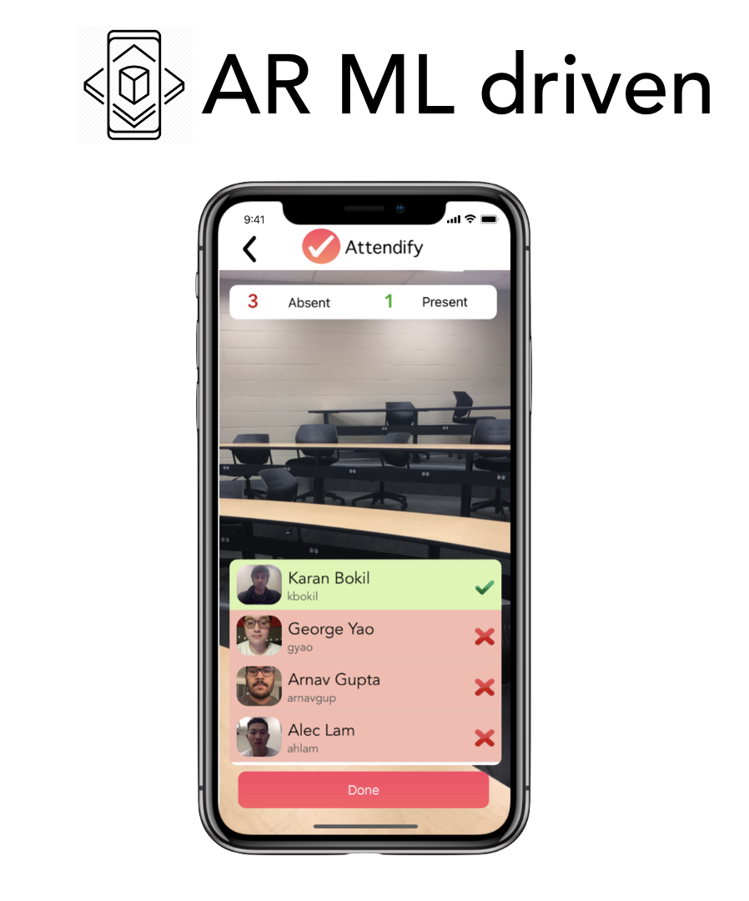
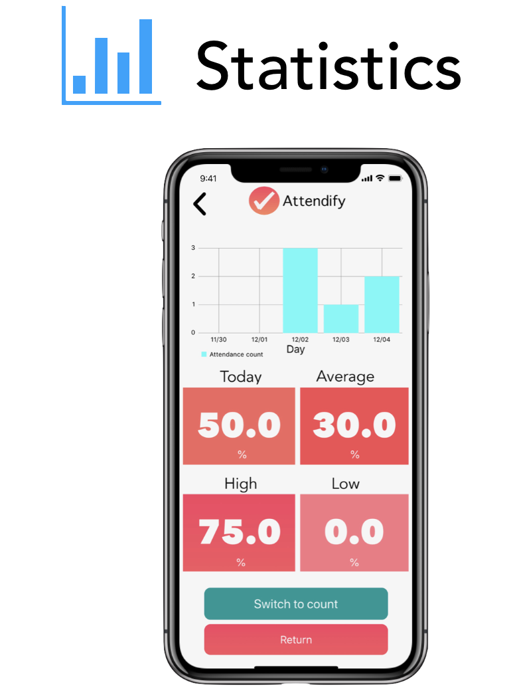
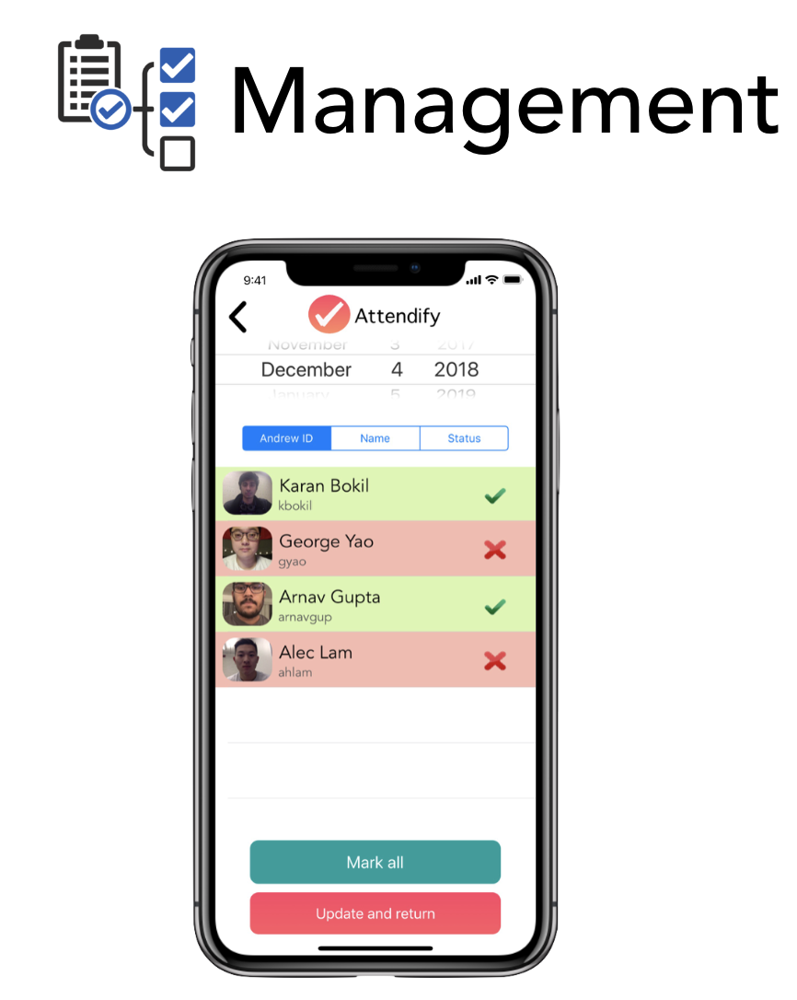
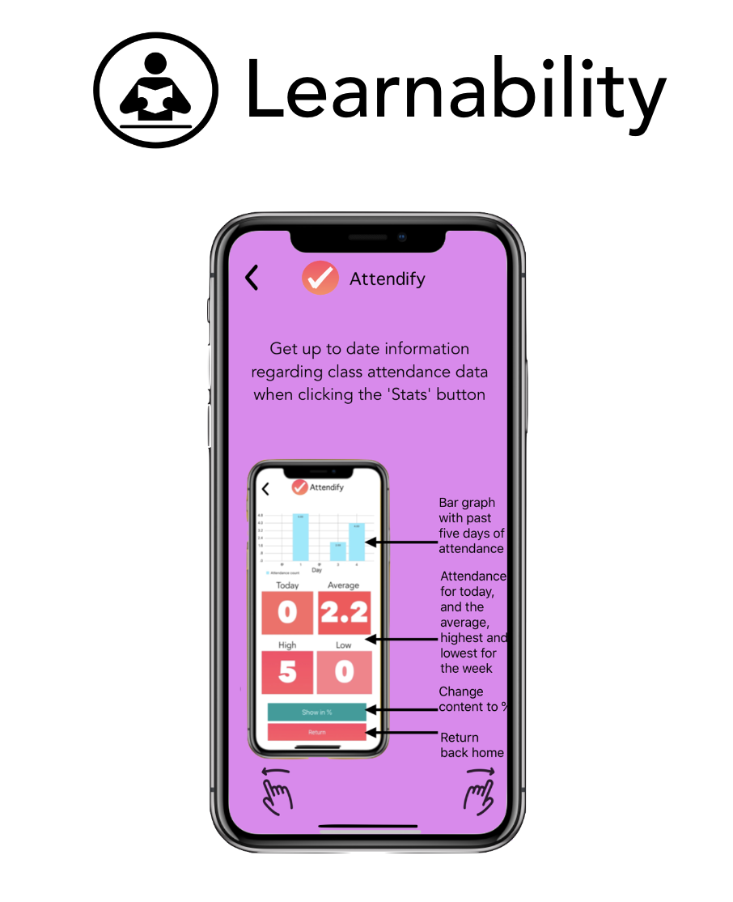
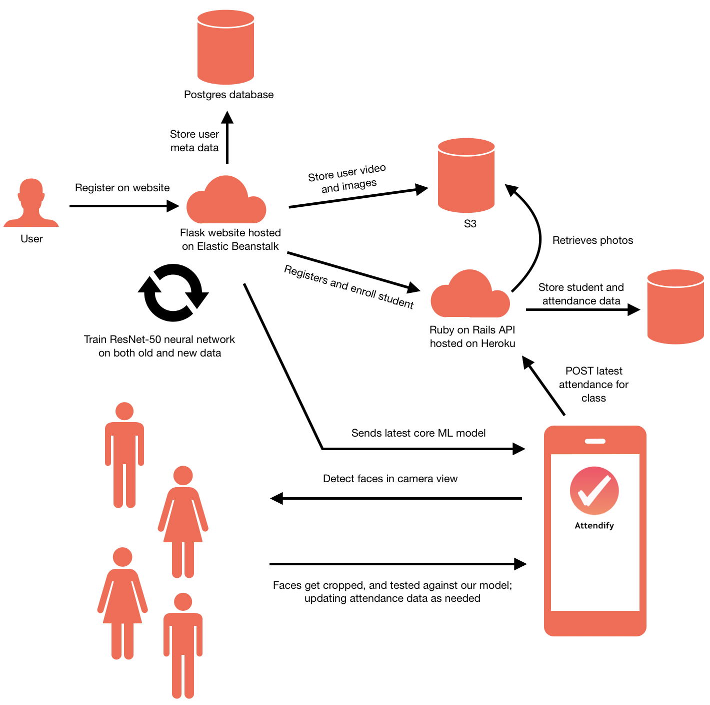
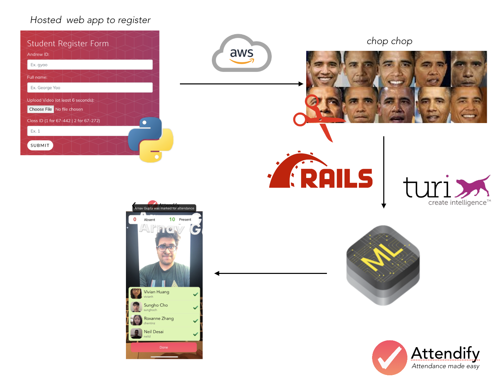

<h1 align="center"> Attendify </h1> <br>
<p align="center">
  
</p>
<p align="center">
  Attendance made easy
</p>

## Table of Contents
* [Team Members](#team-members)
* [Introduction](#introduction)
* [Features](#features)
* [How does it work](#how-does-it-work)
* [Getting started](#getting-started)
* [Future work](#future-work)
* [Built with](#built-with)
* [Acknowledgments](#acknowledgments)
* [License](#license)


## Team Members

* [**Arnav Gupta**](https://github.com/arnavgup) - *Lead UX Designer, Backend Developer, Database Administrator, QA Testing*
* [**George Yao**](https://github.com/gyao852) - *Lead Systems Architect, Full-stack Developer, Data Engineer, QA Testing*

See also a list of those that helped us throughout our project development [here](#acknowledgments).

## Introduction
Attendify is a project we created for 67-442 'Mobile Application Development in iOS' at Carnegie Mellon University (under the Information Systems program). We wanted to address the tedious, time-consuming process of obtaining class attendance for professors. Current attendance systems in place vary in degrees of efficiency and accuracy. For example, paper sign leads to long queues, while iClickers can be easily cheated with a single student answering for his/her peers. With this in mind, we wanted to experience building something with  with Apple's ARKit and CoreML frameworks, as both had exciting new updates this year. Thus comes Attendify, an iOS application that allows professors to take and manage attendance through facial recognition.

## Features
<div>
<p align="center">
  
</p>
<p align="center">
We designed the UI to be as simple as possible, with only four main buttons on the home screen. Recalling the idea that every button should be reachable by one's thumb, we made each button size large enough to be easily pressed, while still being distinct based on shape and color.
</p>
</div>

<div>
<p align="center">
  
</p>
<p align="center">
The facial detection process is made possible through face extraction using Apple's AR Kit 2, while the facial recognition aspect is achieved using a resnet-50 model (a pre-trained neural network with 50 layers that works great as a classifier). Currently, the professor will simply have to scan the class room, and Attendify will take care of the rest. With a total count for absent/present on top, combined with the list of students at the bottom (which gets updated as each students gets detected in real-time), Attendify offers a responsive way for professors to seamlessly take attendance.
</p>
</div>

<div>
<p align="center">
  
</p>
<p align="center">
Using Cocoapod Charts, and SwiftyJSON, Attendify offers the ability to quickly view real-time attendance data; with a dynamic chart, four main cards showing the most important pieces of attendance data, and the ability to interchange between count and percentage.
</p>
</div>

<div>
<p align="center">
  
</p>
<p align="center">
Attendify offers the ability to manage current and previous attendance data in a single view. It can easily look at student Attendance from different days, and change their statuses (if needed). To help with search, we've utilized the familiar iOS date wheel, and added common filters including Andrew ID, name and status.
</p>
</div>

<div>
<p align="center">
  
</p>
<p align="center">
First-time users of the applications can click on the information button at the home screen to see a more step-by-step explanation of each button and feature for each view.
</p>
</div>

<h1 align="center"> Fully Automated Backend </h1>
<div>
<p align="center">
  
</p>
<p align="center">
We designed the entire backend infrastructure in such a way that it doesn't need to be managed after the services are up and running. The flask website houses the registration form, and will automatically create/re-train the ResNet-50 model on the new data. Images are sent to an s3 bucket for storage, and student information is sent to our Ruby on Rails Swagger API. The latest .mlmodel file is automatically downloaded from within the iOS application at runtime (from the Flask web service), which will compile when the user clicks on 'Start Attendance'. Any attendance information from the iOS application currently gets sent to our Ruby on Rails Swagger API endpoints.
</p>
</div>


## How does it work
In this section, we will take a deeper look at how each component works with one another.
### Overview

We created a Flask web service that has a registration form for students. They provide their Andrew ID (which acts as the primary key), their full name, a video of themselves, and the course ID number (as of last testing, we only added 67-442 and 67-272). The video they upload should show their face looking at the camera directly; moving their faces slowly and making different facial expressions. The background should be clear, and the lighting in the room should be adequate (video should not be done outside as this getse typically over-exposed). The length of the video should be at least 8 seconds, however we **highly** recommend to send longer videos. This is because, from each video, we splice it up into a set of images (4 images a frame), extract the faces detected in the image and feed it to our ResNet-50 model. Locally on the flask server, we have a db that houses the Andrew ID, and their photos. Both the videos and the first photo image are sent to AWS S3 buckets, to be read from the iOS application. After the model gets trained, Attendify will download the model automatically, and facial recognition can begin.

### Demo
TODO: ADD demo videos here
TODO: Add explanation


## Getting Started

The following instructions will help you get set up with building the application locally on your computer. Ideally, this should be done on an OSX system, as the preferred IDE for IOS development is Xcode.

**NOTE:** While you may be able to build the application successfully on your local machine, it will NOT run properly if the Flask Web-app (TODO: Add github link to Flask) OR the Ruby on Rails API Service (TODO: Add github link to Swagger) are not running alongside. This is because this iOS application relies on getting the latest .mlmodel file from the Flask web-site, and is currently set to upload data to the Ruby on Rails API service.


### Prerequisites

* Xcode 9+
* Swift 4+
* iPhone 6s Device or above
* Ruby 2+
  ```
  $ sudo brew install ruby
  ```
  **Note:** If you do not have Homebrew, follow instructions [here](https://brew.sh/)
* Cocoapods
  ```
  $ sudo gem install cocoapods
  $ pod setup
  ```

### Setup and Installation

First, download the repository to your local machine
```
git clone git@github.com:arnavgup/Attendify_iOS.git
```
We need to set up cocoapods for this project with the following commands.
```
$ cd faceIT
$ pod init
$ pod install
```
Open up faceIT.xcodeproj in Xcode. If you have an iPhone 6S or above device, plug it into your computer now.


Simply click on the play button at the top left to build and run the project. If you plugged in your iPhone device, it should automatically install on your phone and run locally there; otherwise it will run within XCode's iPhone simulator.

**NOTE:** If you attempt to open this in Xcode Simulator, note that the camera view will NOT work, as that feature is not supported. Load the application onto your iPhone 6s or above device instead.

**Note:** If you cannot build the project, and there arises 80+ compile issues, it is likely that the Swift compile version for the used libraries is not set to 4.x. Within Xcode, on the left hand navigation bar click on the Pods file. Underneath TARGETS, check to make sure that the Swift Language Version is set to Swift 4 or Swift 4.2 for Charts, SwiftyJSON and Toast-Swift via Build Settings -> Basic-> Swift Compiler - Language -> Swift Language Version.

## Future work
We have a series of things that we wanted to implement in the future, to have a more complete experience. These include:

**Accuracy**
* Improve accuracy by showing further example videos, and more thorough instructions
  * Implement some heuristic measure to see if a video is of good quality
* Change the model to be semi-supervised, thereby allowing it to learn from it's mistakes

**Statistics View**
* Implement the ability to change between different Charts
* Add more data cards

**Integration with existing platforms**
* Revise the endpoints to not be of our Swagger API, but rather the cmuis.org API endpoints
* Deploy the Flask API to Andrew Servers, to not pay for AWS EC2 costs

## Built With
* [ARKit 2](https://developer.apple.com/arkit/) - Used to detect faces through facial Nodes, and present text in 3-D space real time

* [Core ML](https://developer.apple.com/documentation/coreml) - Used to run and apply model within iOS environment

* [Turi Create](https://github.com/apple/turicreate) - Used to create the resnet-50 model in .mlmodel form

* [Cocoapods](https://cocoapods.org/) - Used as a dependency manager for Swift projects

* [Flask](http://flask.pocoo.org/) - Used to build our front-end web application that houses the registration form, and trains the resnet-50 model

* [Ruby on Rails](https://rubyonrails.org/) - Used to create an API service to act as our endpoints

* [Git](https://git-scm.com/) - Used for version control


## Acknowledgments
* **NovaTec Consulting**

  We based the AR view component of our project from their [example](https://github.com/NovatecConsulting/FaceRecognition-in-ARKit). They used Vision-API to run the extracted faces against their model, and similarly ran the extracted student faces against our pre-trained resnet-50 model. Their example was what inspired us into believing that we can truly achieve something really cool using AR Kit and CoreML.

* **Gorilla Logic**

  Gorilla Logic had a [piece](https://gorillalogic.com/blog/how-to-build-a-face-recognition-app-in-ios-using-coreml-and-turi-create-part-2/) showing a step-by-step process of their face recognition application. We followed a similar approach in hosting our Flask application on AWS Elastic Beanstalk. However, what was really significant was how they explained the power of Turi Create; specifically how to use their library to create the model within a Flask (python) environment.

* **Jose Vazquez** - *Lead iOS engineer/Senior Manager at Capital One*

  Jose acted as our project mentor, advising us all the way from the start with the ideation process, to our final project iteration. He gave a lot of useful insight regarding iOS design patterns, important notes regarding user-testing, as well as early technical support regarding compiling the ML model at run-time.

* **Professor Larry Heimann** - *Information Systems Teaching Professor at Carnegie Mellon University*

  Professor Heimann allowed us to perform several user-testing during his classes, allowing us to attempt to try the application in a more appropriate testing environment (as opposed to individual testing amongst our friends). He also provided a lot of useful feedback regarding UX, and the overall design usage for the application.

* **Frank Liao, Jordan Stapinski, Kenny Cohen** - *67-442 Teaching Assistants*

  The course TAs provided useful feedback throughout each project sprint, and we ultimately incorporated a lot of their feedback into our UI and system design.


## License

This project is licensed under the MIT License.
